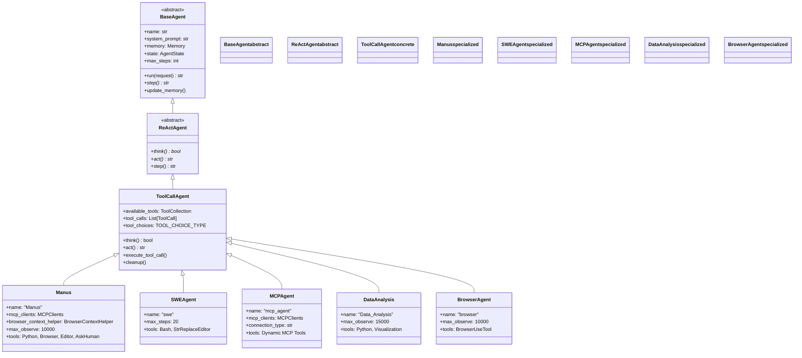
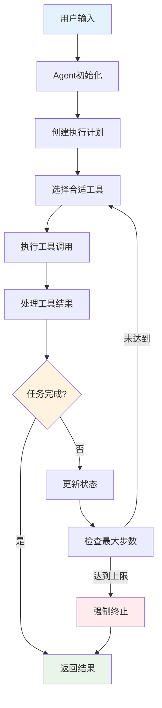

# OpenManus 学习笔记

## 项目概述

- 开源 AI Agent 框架，类似 Manus 但无需邀请码
- MetaGPT 团队开发，支持多种 AI 模型
- 目标：构建通用 AI Agent，解决各种任务

## 核心架构

### 1. Agent 系统

**继承层次结构：**



**各层级功能：**

**BaseAgent (抽象基类)**

- 状态管理、内存管理、执行循环
- 定义抽象方法 `step()`
- 核心属性：`name`, `system_prompt`, `memory`, `state`, `max_steps`

**ReActAgent (中间层)**

- 实现 ReAct 模式：`think()` → `act()` → `step()`
- 定义抽象方法 `think()` 和 `act()`

**ToolCallAgent (工具基类)**

- 实现工具调用功能和工具集合管理
- 核心属性：`available_tools`, `tool_calls`, `tool_choices`

**具体 Agent 实现：**

- **Manus**: 通用 Agent，支持 MCP+浏览器，工具最全面
- **SWEAgent**: 软件工程专用，只有 Bash+编辑器
- **MCPAgent**: MCP 协议专用，动态加载远程工具
- **DataAnalysis**: 数据分析专用，Python+可视化工具
- **BrowserAgent**: 浏览器控制专用，只有浏览器工具

### 2. 工具系统

**工具架构图：**

```mermaid
graph TB
    subgraph "工具基类"
        BaseTool[BaseTool 抽象基类]
        BaseTool --> |实现| ToolResult[ToolResult 结果类]
    end

    subgraph "核心工具"
        PythonExecute[PythonExecute<br/>Python代码执行]
        BrowserUseTool[BrowserUseTool<br/>浏览器自动化]
        StrReplaceEditor[StrReplaceEditor<br/>文件编辑器]
        Bash[Bash<br/>命令行执行]
        WebSearch[WebSearch<br/>网络搜索]
        AskHuman[AskHuman<br/>人机交互]
        Terminate[Terminate<br/>终止工具]
    end

    subgraph "专用工具"
        MCPClientTool[MCPClientTool<br/>MCP协议工具]
        VisualizationPrepare[VisualizationPrepare<br/>可视化准备]
        DataVisualization[DataVisualization<br/>数据可视化]
        NormalPythonExecute[NormalPythonExecute<br/>数据分析Python]
    end

    subgraph "工具管理"
        ToolCollection[ToolCollection<br/>工具集合管理器]
    end

    BaseTool -.-> PythonExecute
    BaseTool -.-> BrowserUseTool
    BaseTool -.-> StrReplaceEditor
    BaseTool -.-> Bash
    BaseTool -.-> WebSearch
    BaseTool -.-> AskHuman
    BaseTool -.-> Terminate
    BaseTool -.-> MCPClientTool
    BaseTool -.-> VisualizationPrepare
    BaseTool -.-> DataVisualization
    BaseTool -.-> NormalPythonExecute

    ToolCollection --> PythonExecute
    ToolCollection --> BrowserUseTool
    ToolCollection --> StrReplaceEditor
    ToolCollection --> Bash
    ToolCollection --> WebSearch
    ToolCollection --> AskHuman
    ToolCollection --> Terminate
    ToolCollection --> MCPClientTool
    ToolCollection --> VisualizationPrepare
    ToolCollection --> DataVisualization
    ToolCollection --> NormalPythonExecute

    style BaseTool fill:#e1f5fe
    style ToolCollection fill:#f3e5f5
    style PythonExecute fill:#e8f5e8
    style BrowserUseTool fill:#e8f5e8
    style StrReplaceEditor fill:#e8f5e8
```



**核心工具说明：**

- `PythonExecute`: Python 代码执行，支持超时控制
- `BrowserUseTool`: 浏览器自动化，网页操作
- `StrReplaceEditor`: 文件编辑器
- `Bash`: 命令行执行
- `WebSearch`: 网络搜索
- `AskHuman`: 人机交互
- `MCPClientTool`: MCP 协议工具

**各 Agent 工具配置：**

```python
# Manus - 通用全能型
ToolCollection(
    PythonExecute(),      # Python执行
    BrowserUseTool(),     # 浏览器操作
    StrReplaceEditor(),   # 文件编辑
    AskHuman(),          # 人机交互
    Terminate()          # 终止工具
)

# SWEAgent - 软件工程型
ToolCollection(
    Bash(),              # 命令行
    StrReplaceEditor(),  # 文件编辑
    Terminate()          # 终止工具
)

# DataAnalysis - 数据分析型
ToolCollection(
    NormalPythonExecute(),    # Python执行
    VisualizationPrepare(),   # 可视化准备
    DataVisualization(),      # 数据可视化
    Terminate()               # 终止工具
)

# BrowserAgent - 浏览器型
ToolCollection(
    BrowserUseTool(),    # 浏览器操作
    Terminate()          # 终止工具
)
```

### 3. 沙箱环境

- Docker 容器化执行
- 资源限制（内存、CPU、超时）
- 文件操作安全隔离
- 支持本地和沙箱两种模式

### 4. 流程控制

**PlanningFlow 核心逻辑：**

1. 接收用户输入
2. 创建执行计划
3. 分解任务步骤
4. 选择合适 Agent 执行
5. 跟踪步骤状态
6. 返回执行结果

**步骤状态：**

- `NOT_STARTED`: 未开始
- `IN_PROGRESS`: 进行中
- `COMPLETED`: 已完成
- `BLOCKED`: 被阻塞

## 运行模式

### 1. 基础模式 (main.py)

```bash
python main.py
```

- 单 Agent 执行
- 直接交互模式

### 2. 多 Agent 协作 (run_flow.py)

```bash
python run_flow.py
```

- 支持多 Agent 协作
- 自动任务规划
- 可启用数据分析 Agent

### 3. MCP 工具模式 (run_mcp.py)

```bash
python run_mcp.py
```

- 连接 MCP 服务器
- 使用远程工具
- 支持 stdio 和 sse 连接

## 配置系统

**支持的 LLM：**

- OpenAI GPT 系列
- Anthropic Claude 系列
- Azure OpenAI
- Ollama 本地模型
- AWS Bedrock

**配置文件：** `config/config.toml`

```toml
[llm]
model = "claude-3-7-sonnet-20250219"
base_url = "https://api.anthropic.com/v1/"
api_key = "YOUR_API_KEY"
max_tokens = 8192
temperature = 0.0

[browser]
headless = false
disable_security = true

[sandbox]
use_sandbox = false
image = "python:3.12-slim"
memory_limit = "512m"
```

## 关键特性

### 1. 安全机制

- Docker 沙箱隔离
- 工具执行超时
- 资源使用限制
- 错误处理恢复

### 2. 扩展性

- 模块化设计
- 工具插件系统
- MCP 协议支持
- 自定义 Agent 开发

### 3. 多模态支持

- 文本处理
- 图像识别（vision 模型）
- 网页交互
- 文件操作

## 实际应用场景

1. **代码开发**: SWEAgent 处理编程任务
2. **数据分析**: DataAnalysis Agent 处理数据可视化
3. **网页操作**: 浏览器自动化任务
4. **文件处理**: 批量文件操作
5. **研究助手**: 网络搜索+信息整理

## 开发要点

### Agent 开发模式

```python
class CustomAgent(ToolCallAgent):
    name: str = "custom"
    description: str = "自定义Agent"
    system_prompt: str = "你的系统提示词"
    available_tools: ToolCollection = ToolCollection(
        # 添加需要的工具
    )
```

### 工具开发模式

```python
class CustomTool(BaseTool):
    name: str = "custom_tool"
    description: str = "工具描述"

    async def execute(self, **kwargs) -> Any:
        # 工具执行逻辑
        return result
```

## 项目结构

```
OpenManus/
├── app/
│   ├── agent/          # Agent实现
│   ├── tool/           # 工具集合
│   ├── flow/           # 流程控制
│   ├── sandbox/        # 沙箱环境
│   ├── mcp/           # MCP协议
│   └── prompt/        # 提示词模板
├── config/            # 配置文件
├── examples/          # 示例代码
└── workspace/         # 工作目录
```

## 架构设计模式

### 1. 继承层次设计

- **模板方法模式**: BaseAgent 定义执行框架，子类实现具体逻辑
- **策略模式**: 不同 Agent 使用不同的工具策略
- **抽象工厂模式**: 通过继承创建不同类型的 Agent

### 2. 组合关系

- **组合模式**: Agent 通过 ToolCollection 管理工具
- **依赖注入**: LLM、Memory 等组件可配置
- **观察者模式**: 状态变化和事件处理

### 3. 执行流程



### 4. 扩展性设计

- **插件化工具系统**: 易于添加新工具
- **模块化 Agent**: 可组合不同能力
- **配置驱动**: 支持多种 LLM 和环境

## 总结

OpenManus 是一个功能完整的 AI Agent 框架，核心优势：

- 开源免费，无需邀请码
- 支持多种 LLM 和工具
- 安全的沙箱执行环境
- 灵活的多 Agent 协作
- 清晰的继承层次和设计模式
- 易于扩展和定制

适合用于学习 AI Agent 开发，也可以直接用于实际项目。
